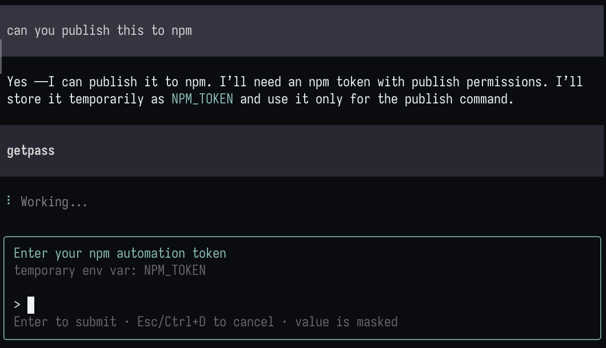

# pi-getpass

A pi package that adds a `getpass` tool for collecting secrets safely from the user.



When the agent needs an API key, token, password, or other secret, it calls `getpass` with an exact env var name like `OPENAI_API_KEY`. The package temporarily replaces the normal pi input UI with a masked secret input, stores the secret in `process.env` for the current pi process, and returns only the env var name to the model. The secret value is not written to chat/session history.


## getpass web (asynchronous, non-TUI lifecycle)

`getpass` with `via: "web"` implements the **getpass web** flow. It immediately returns a relayable tailnet URL and opaque request ID before submission. A single-use page accepts the secret; background capture then populates only the requested tracked environment variable and activates redaction. The request has a TTL and can be checked, consumed, or cancelled without returning the secret:

```text
getpass_web_status   { requestId }
getpass_web_consume  { requestId }
getpass_web_cancel   { requestId }
```

Each request is isolated. Duplicate submissions, expiry, cancellation, and session shutdown close the server and remove temporary 0600 artifacts. The secret is never printed or included in chat/history, tool output, logs, intercom messages, or command text. Smoke test: `npx tsx tests/smoke-web.ts`.

## What this is / is not

`pi-getpass` is a convenience tool for getting a secret from you without asking you to paste it into chat or manually write it into an `.env` file first.

It is **not** a sandbox:

- It does not stop the agent, shell commands, other extensions, or child processes from reading the env var.
- It cannot prevent a process from writing a secret directly to external logs, files, or services.
- Redaction applies to tool output and `!`/`!!` shell output visible through pi, including streaming and finalized results.
- Tool-call arguments are not rewritten, since changing them could break commands that intentionally consume the secret through shell expansion.
- It only tracks values collected by `getpass` in the current extension runtime; pre-existing environment variables are not redacted.
- Reloading or restarting pi clears the tracked-value set. Recollect a disposable value before each redaction test.
- Redaction matches contiguous, exact plaintext values; encoded or transformed variants are not detected.

Use normal secret hygiene: avoid tracing, unset secrets when done, and review commands that consume them. Tracked secret values appearing in pi-visible tool output are replaced with `****`.

## Install

```bash
pi install git:github.com/Microwave-WYB/pi-getpass
```

For local development from a clone:

```bash
git clone https://github.com/Microwave-WYB/pi-getpass.git
cd pi-getpass
pi install .
# or for one run only:
pi -e .
```

## Tools

### `getpass`

Collect a secret and store it in a temporary env var.

Parameters:

- `envVar` — exact env var name to populate, e.g. `OPENAI_API_KEY`, `GITHUB_TOKEN`, `DATABASE_URL`
- `overwrite` — allow replacing an existing env var of the same name; default `false`
- `prompt` — text shown to the user
- `allowEmpty` — allow an empty secret

Example agent flow:

1. Call `getpass` with `{ "envVar": "OPENAI_API_KEY", "prompt": "Enter your OpenAI API key" }`.
2. Use `$OPENAI_API_KEY` in later `bash` calls, for example:

```bash
printf 'OPENAI_API_KEY=%s\n' "$OPENAI_API_KEY" >> .env
```

Avoid echoing or printing real secrets. For redaction testing, use a disposable test value.

### `getpass_list`

List env var names populated by `getpass` in the current pi runtime. Returns names only, never values.

### `getpass_unset`

Unset a getpass env var from the current pi process:

```json
{ "envVar": "OPENAI_API_KEY" }
```

## Commands

```text
/getpass OPENAI_API_KEY
/getpass-list
/getpass-unset OPENAI_API_KEY
```

Variables are temporary and last only for the current pi process/session runtime, unless explicitly written somewhere by a later command.

## Development

```bash
# typecheck (symlink setup must be present in node_modules; see below)
npx tsc --noEmit

# unit tests (redaction)
npm test

# web-mode smoke test (needs tailscale; auto-submits a secret to a local server)
npx tsx tests/smoke-web.ts
```

`node_modules` contains symlinks to the installed pi packages
(`@earendil-works/pi-coding-agent`, `pi-tui`, `typebox`) plus the TypeScript
compiler, so `npx tsc` resolves the real compiler instead of the unrelated
legacy `tsc` npm package. `tsconfig.json` enables `allowImportingTsExtensions`
because sources import each other with explicit `.ts` extensions for `tsx` /
`node --experimental-strip-types` execution.

## Verify redaction

Use a disposable value, never a real credential:

1. Run `/getpass PI_GETPASS_TEST` and enter `hello` in the masked prompt.
2. Run `!echo "$PI_GETPASS_TEST"` to test the direct `!` shell path.
3. Ask the agent to run `echo "$PI_GETPASS_TEST"` to test tool output.

Both outputs should display `****`. Run `/getpass` again after `/reload` or a restart because tracking is intentionally runtime-local.
